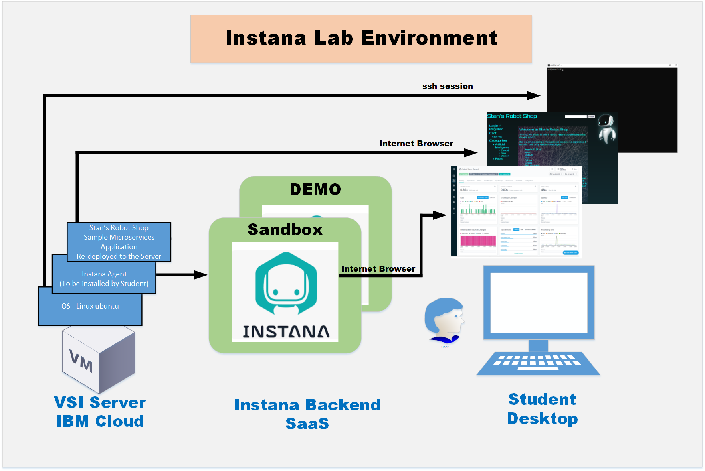
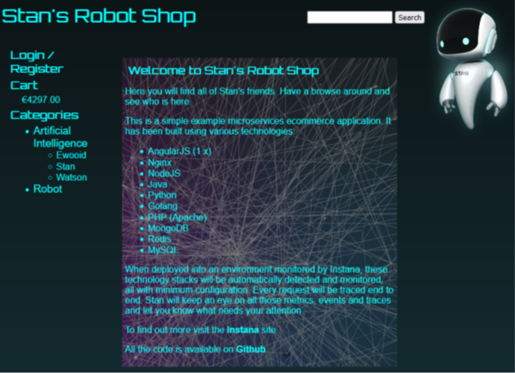

export const Title = () => (
  
    Lab Environment  
  
);
;

## Lab Architecture: 

You will have access to both the Instana Demo and Sandbox instances. 

For the labs we will be utilizing the Sandbox instance. 
https://sandbox-partner.instana.io 

The Instana Demo can be used for client demonstrations at a later date or for learning purposes. 
https://demo-partner.instana.io/

## Stan's Robot Shop App - Sample Microservices Application:

Stan's Robot Shop is a sample microservice application we use in the sandbox environment to test and learn containerized application orchestration and monitoring techniques.

https://github.com/instana/robot-shop

