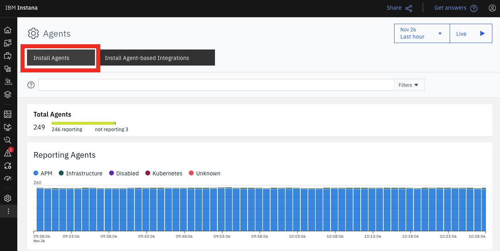

export const Title = () => (
  <span>
    Lab 1 - Agent Installation <br />
  </span>
);
;

## Lab Overview

Instana collects data from monitored systems by using a single host agent on each host. The host agent runs on your hosts to collect and aggregate data from various sensors before it sends the data to the Instana backend.  In this lab you will be installing a host agent on your assigned Linux Ubuntu virtual machine.   In the second part of this lab you will be verifying your virtual machine is seen by the Instana sandbox environment and visible in the Infrastructure map view.  You will also use the Dynamic Focus Query(DFQ) to filter on for your specific machine.

## Step 1: 

All Students should have received an e-mail inviting them to join the Instana partner tenant. 

Click Join Instana.


You will have access to both the Demo and Sandbox Instana. 

For the Labs we will be accessing the Sandbox instance. 

Launch the Sandbox Instana Portal from the browser: https://sandbox-partner.instana.io 

Your screen will look like this: 


## Step 2:

Click on the three dots "More" from the sidebar.

Then select Agents.


Once you are on the Agents screen, select Installing Instana Agents.



## Step 3:

You will see a list of supported technologies on the sidebar. 

Select Linux from the list.


Leave the options at their default settings, and select the "Install and start as a service" option.

When you are ready, hit the Copy button to copy the one-liner to your clipboard.

## Step 4:

SSH into the training host that has been provided as “ubuntu” (your instructor will provide a host IP address and password).

```
ssh ubuntu@<IP address>
```

Paste the CURL statement that you copied in the last step into your terminal window and hit enter. 
You should see a screen that will look similar to the one below. Please enter “y” and hit enter. This will  start the installation process.


## Step 5:

Once the installation is complete, we need to validate that our work has been successful. 
To accomplish this, we will want to navigate to the Infrastructure page of the Instana UI. 

Note: You may need to refresh and give it a minute. 


When in the infrastructure map section, we will see an open text field. 
We are using DFQ or “Dynamic Focus Query” to filter the content on the screen. 

In this scenario, we will use DFQ to filter on our host using:

```
entity.host.name:<your host name> 
```


If you see your host in the map, you have validated that the installation was successful. 
