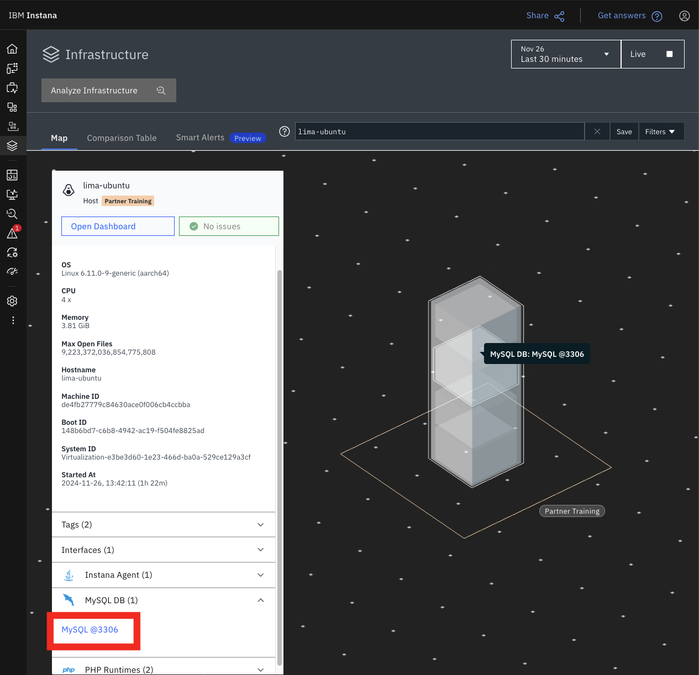
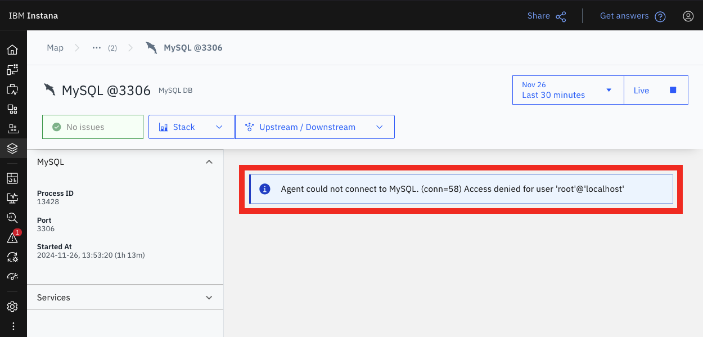

export const Title = () => (
  <span>
    Lab 10 - LAMP Stack Monitoring <br />
  </span>
);
;

## Lab Overview

In this lab you will configure monitoring of a simple LAMP (Linux-Apache-MySQL-PHP) stack application. 

- teach you agent config for given tech
- how to go about the configuration in practical scenario, i.e. step-by-step, consulting the manual, addin respective configs
-

## Step 1: Deploy LAMP stack

We'll deploy the LAMP stack on the VM using a pre-installed Ansible playbook. SSH into your host and run the following command:

```sh
ansible-playbook lamp-install.yml
```

After the playbook completes without any errors, an Apache HTTP server with PHP plugin and a MySQL server are installed and running on the machine. To verify the application is running issue the following in the terminal:

```sh
curl localhost:8000/test.php
```

You can also open the url in your browser.

Anytime the page is loaded a new record is inserted into the MySQL database and the whole updated table is printed as a result.

## Step 2: Apache HTTPd monitoring

When configuring monitoring for a given technology always check with the Instana documentation! Apache HTTPd server is covered in section [Monitoring Apache HTTPd](https://www.ibm.com/docs/en/instana-observability/current?topic=technologies-monitoring-apache-httpd)

For full monitoring, Instana reads some metrics from the Apache server `/server-status` status page, which must be configured and enabled on the server. In our case, the status endpoint is arleady enabled as part of the Apache server installation. Otherwise, follow the Instana manual on how to enable the module.

You may verify that Instana preiodically reads the `/server-status` page by checking the access log: 

```sh
sudo tail -f /var/log/apache2/access.log
```

Press CTRL-C to stop the access log list. If the `/server-status` messages show a result code 200 then everyting works fine.

### Enable tracing

Cross-check the [documentation](https://www.ibm.com/docs/en/instana-observability/current?topic=technologies-monitoring-apache-httpd#enable-tracing) to learn more about tracing of an HTTPd server.

Enable tracing with automatic download and activation of the tracing module. Open the `/opt/instana/agent/etc/instana/configuration.yaml` file, locate and uncomment the lines:

```
#com.instana.plugin.httpd:
#  tracing:
#    enabled: false
#    autoRestart: false
```

Set the values to `true`
```yaml
com.instana.plugin.httpd:
  tracing:
    enabled: true
    autoRestart: true
```

## Step 2: PHP monitoring

PHP monitoring is covered in [the corresponding section](https://www.ibm.com/docs/en/instana-observability/current?topic=technologies-monitoring-php) of the manual.

In our case of Apache2 with mod_php there is virtually no configuration needed. PHP tracing is enabled by default.


## Step 3: MySQL monitoring

Locate your VM in the Instana Infrastructure view and open the MySQL DB dashboard



You will notice the message that the agent is unable to connect to MySQL because of missing access credentials.



Edit your agent configuration file `/opt/instana/agent/etc/instana/configuration.yaml` and uncomment the lines:
```
# com.instana.plugin.mysql:
#   user: ''
#   password: ''
```

Fill in the MySQL admin user and password:
```yaml
com.instana.plugin.mysql:
  user: 'root'
  password: 'password'
```

For full monitoring, it may also be required to set some additional user permissions. In the terminal, login to mysql as root user:
```sh
sudo mysql
```

Copy and paste the following statements into the mysql session (see docs for details)
```
GRANT REPLICATION CLIENT ON *.* TO 'testuser'@'localhost';
GRANT SELECT ON performance_schema.events_waits_summary_global_by_event_name TO 'testuser'@'localhost';
GRANT SELECT ON performance_schema.events_statements_summary_by_digest TO 'testuser'@'localhost';
GRANT SELECT ON performance_schema.events_statements_summary_global_by_event_name TO 'testuser'@'localhost';
GRANT SELECT ON performance_schema.replication_connection_status TO 'testuser'@'localhost';
GRANT PROCESS ON *.* TO 'testuser'@'localhost';
SET GLOBAL innodb_monitor_enable = 'trx_nl_ro_commits';
SET GLOBAL innodb_monitor_enable = 'trx_ro_commits';
SET GLOBAL innodb_monitor_enable = 'trx_rollbacks';
SET GLOBAL innodb_monitor_enable = 'trx_rw_commits';
```
