--
title: Lab2
---
export const Title = () => (
  <span>
    Lab 2 - Agent Troubleshooting <br />
  </span>
);
;

## Lab Overview

In this lab you will be focusing on Linux deployments of the Instana agent. You will learn to access your log files, change your log level to view more troubleshooting detail, and stop and start your agent service for the purpose of troubleshooting your agent. 

## Step 1:

We will SSH into the machine that was provided to us. Agent logs are located at:

```
cd /opt/instana/agent/data/log
```

In the event that there is an issue, this would be where we would pull our logfiles. 

This is an important area to have knowledge of, as support will ask for these logs during troubleshooting sessions. 

It is also possible to download the logs in the UI if you have access to the UI.

## Step 2: 

To start agent debug logging, you will need to stop the agent.

Enter the following in your terminal window:

```
sudo service instana-agent stop
```

We can then validate that the service has stopped by entering:

```
sudo service instana-agent status
```

Hint: type “:q” to exit status command.


## Step 3:

Delete all of the files in /opt/instana/agent/data/log

```
sudo rm /opt/instana/agent/data/log/*
```

Check to make sure files are deleted.

## Step 4:

To set the log level to debug, first browse to 

```
cd /opt/instana/agent/etc
```

We will be editing org.ops4j.pax.logging.cfg using the vi editor.

Note that a list of common vi commands are provided towards the end of this lab material in the Reference - vi Editor section. 

An alternative to the vi editor is nano. I may be easier for those that are not familiar with the vi editor.

```
sudo vi org.ops4j.pax.logging.cfg
```

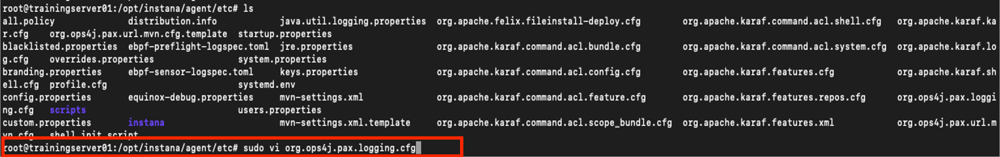

Now, change from INFO to DEBUG on the line seen below.
Check out vi commands if you are experiencing an issue.

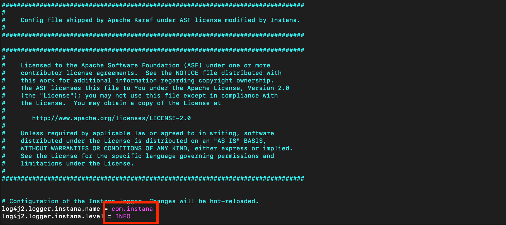

Once you have modified with the proper value, save your work.

## Step 5:

Start the agent by entering the following line into the terminal window:

```
sudo service instana-agent start
```

Validate that the service has started by entering:

```
sudo service instana-agent status
```

## Step 6:

Verify logging is now at Debug by viewing the agent.log file after navigating to

```
cd /opt/instana/agent/data/log
```

Feel free to revert the log level to INFO if you'd like.


## Step 7:

Manager Agent from the Instana Portal 

The Agent Management Dashboard displays the agent configuration and current runtime metrics. In the management area, configurations can be changed, and operations such as a restart can be run. Further down runtime metrics, and the current agent log are shown.

Agents view:
The Agents view, which is located in the main navigation bar under More > Agents, provides an overview of all host agents that report to the Instana tenant unit.
When you use the search bar on the page, the view can be narrowed down to a subset of agents by using Dynamic Focus Queries.

Go to the Agent Management Dashboard 
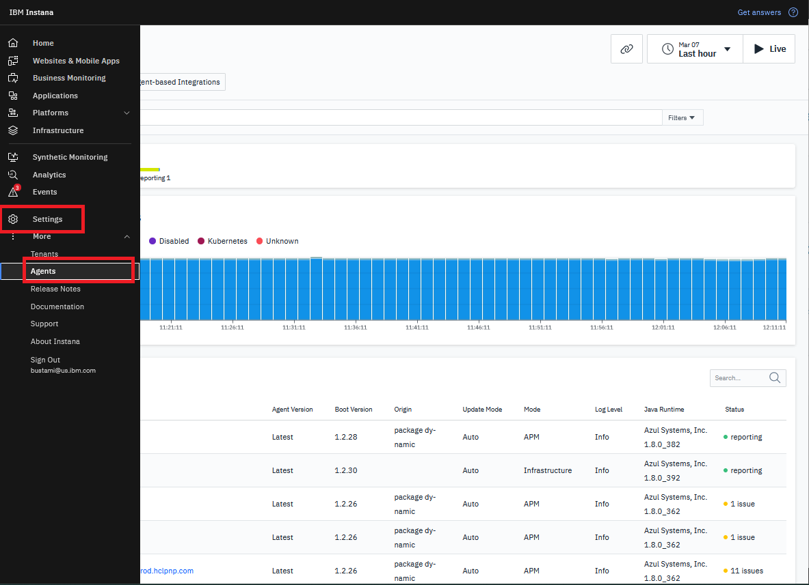

Look for for your Agent Name, and validate that the Agent is "Reporting" and with "Green" color circle to show that is he healthy.  
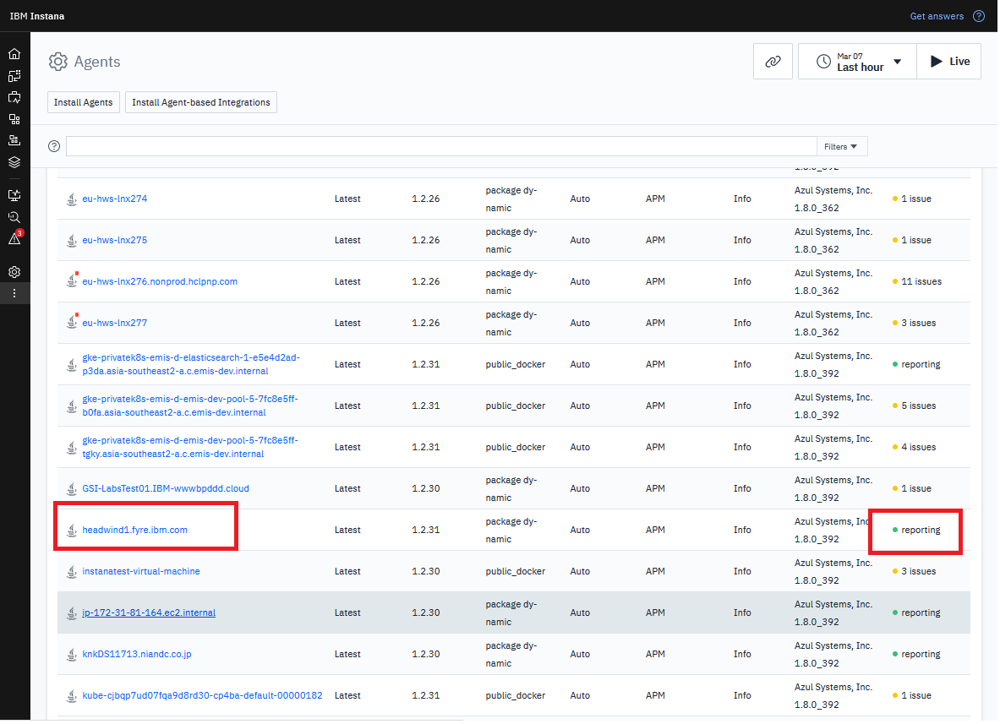

Changing Agent modes:
The host agent mode is relevant for host-based licensing, and it is used to decide whether the agent counts as an Infrastructure or an APM agent. The host agent mode can be toggled by using Change Agent Mode control.
In the Change Agent Mode dialog, the following options are provided:
    APM, which maps to the APM host agent mode
    Infrastructure, which maps to the INFRASTRUCTURE host agent mode
    Disabled, which maps to the OFF host agent mode
Make sure that you Agent is set for "APM"
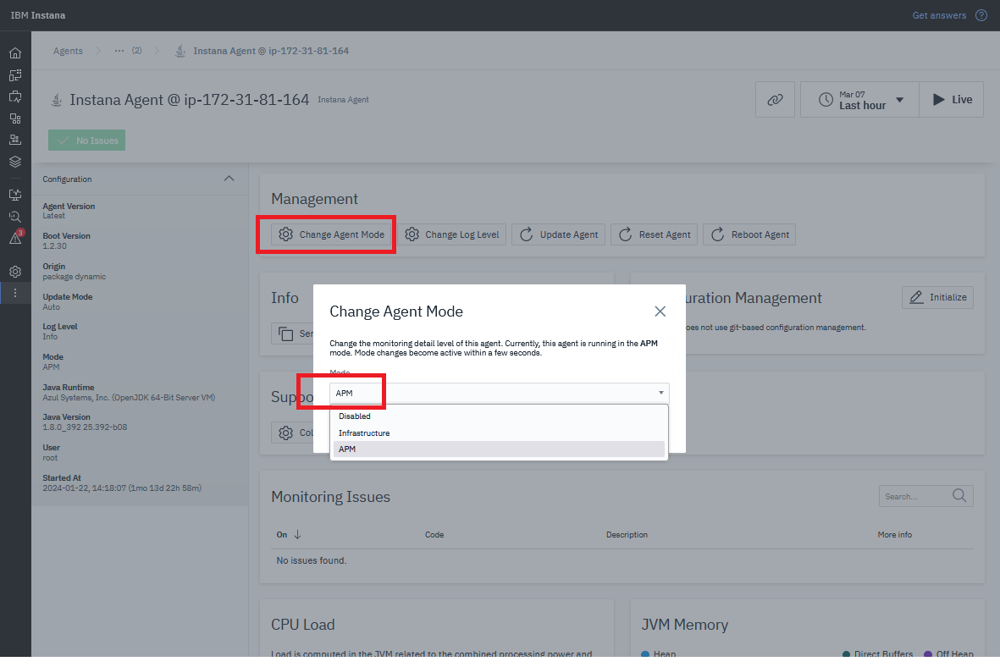

Changing log level:
The log level defines the level of detail that the agent logs contain.
In the Change Agent Log Level dialog, the following options are provided:
    INFO, normal level of details
    DEBUG, extended details for troubleshooting
    TRACE, most details for further problem analysis
Make sure that you Agent is set for "APM"
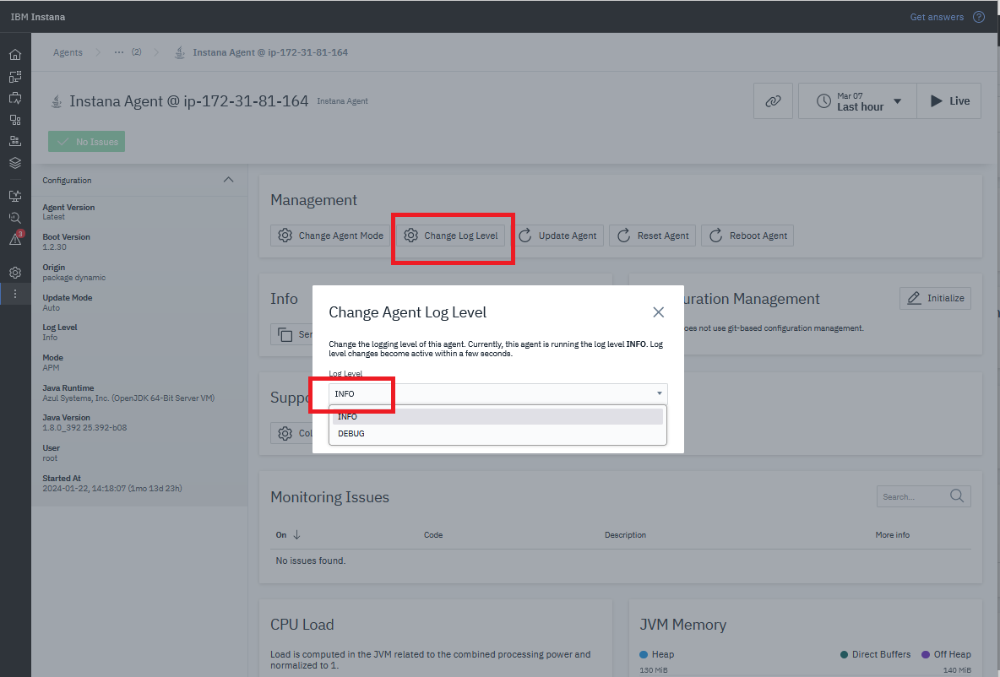

Updating Agents:
This button manually triggers the agent auto update as described at Updates of Dynamic Host Agents.
Note; During the update, the host agent cannot provide any data so you might see a short gap.

Resetting Agents:
Resetting the agent is similar to restarting the agent process, but the current process remains active. It means that OS level watchdogs and service scripts will not see the process identifier (pid) changing.
Note; During the reset, the host agent cannot provide any data, so you might see a short gap.

Rebooting Agents:
Rebooting the agent stops the current agent process and create a new one. The process of the used start script remains unchanged, but operating system level watchdogs and service scripts might see a changed process identifier (pid) depending on their watch target.
Note; During the restart, the host agent cannot provide any data, which results in a short gap.

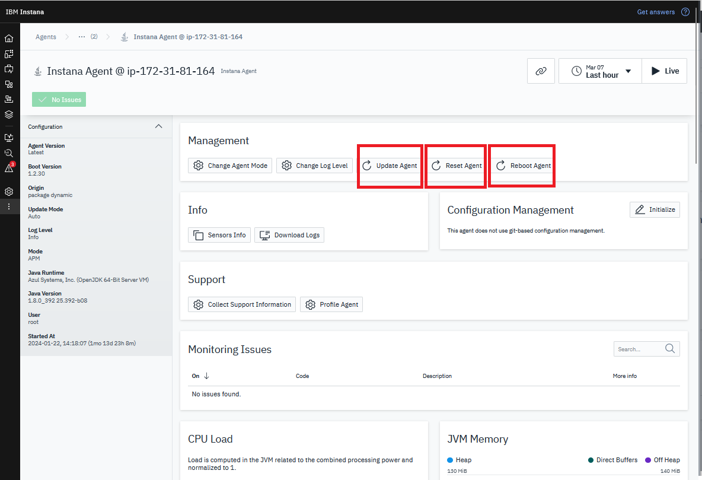

Sensor information:
To view the list of sensors and host agent components that are used by the agent, click Sensors Info.
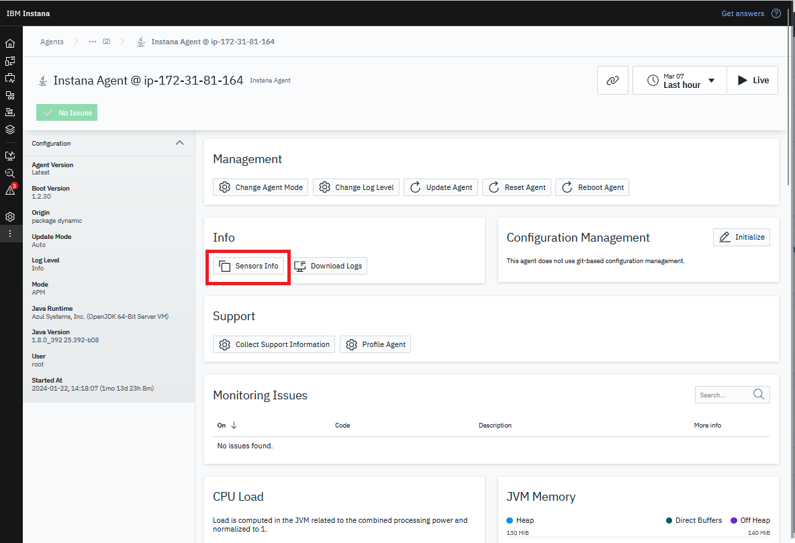

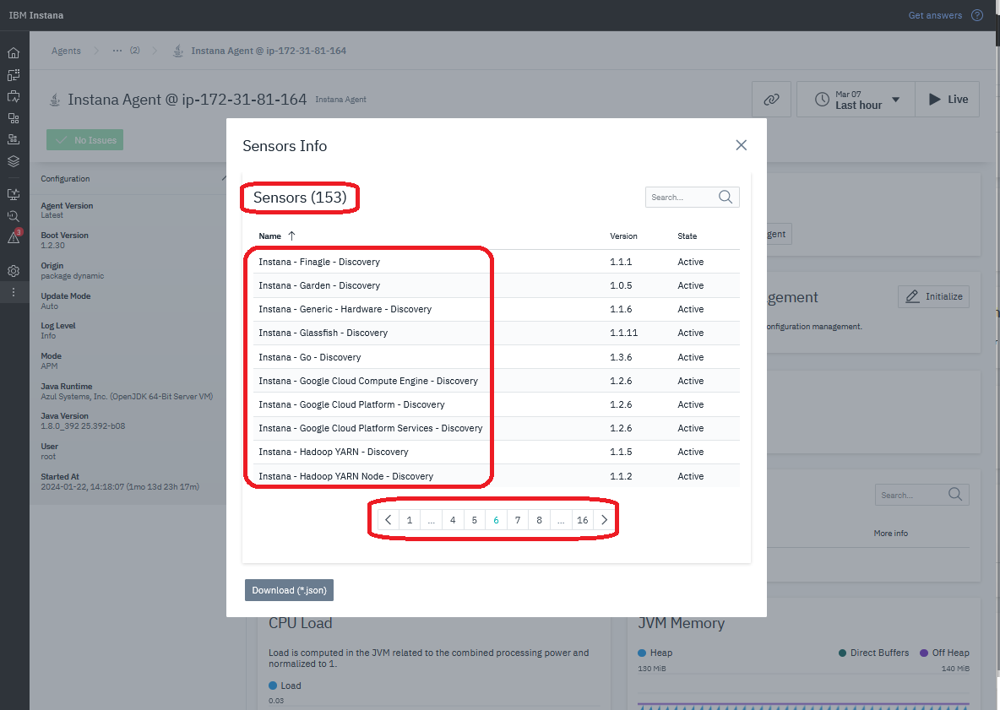

Self monitoring:
Not only is the host agent monitoring other software that is running on the host, but it also does constant lightweight self-monitoring. Gathered metrics can be used to observe host agent performance and resource consumption:

Agent metrics:
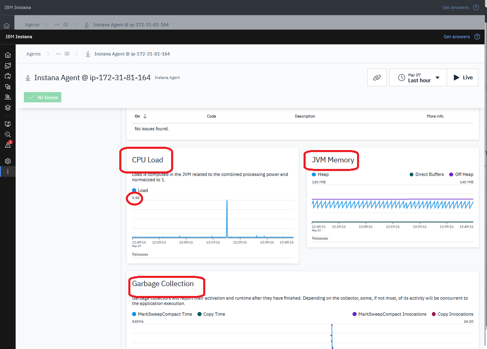

Agent Logs: 
You can see the Agent log from Insana portal 
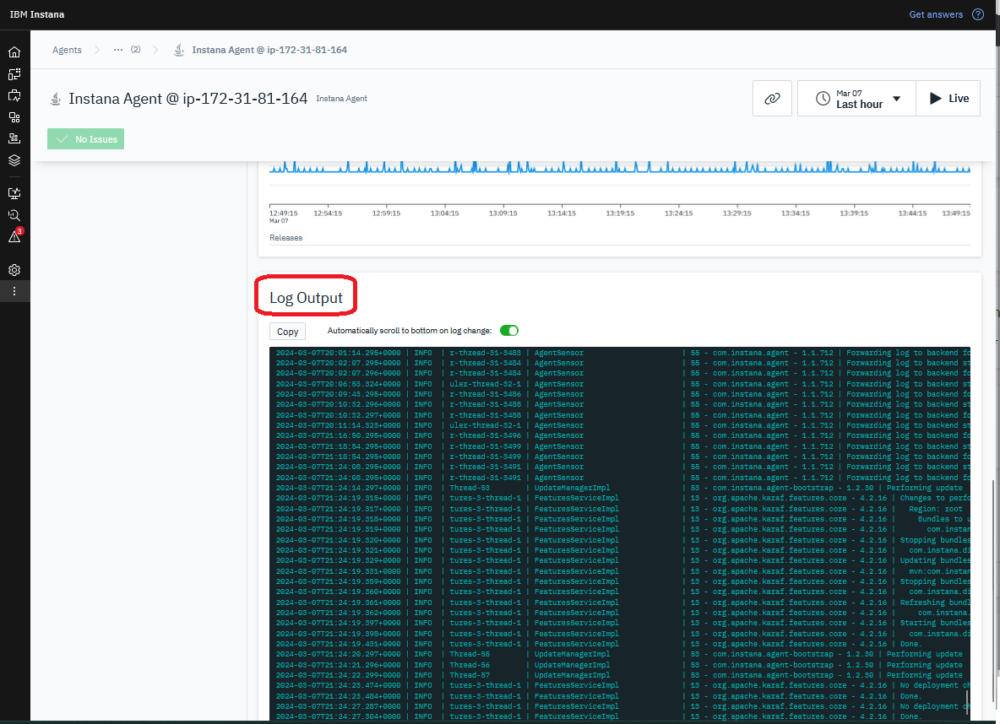