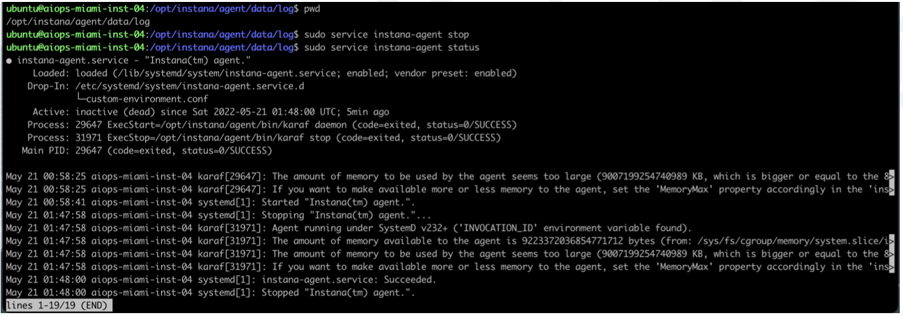
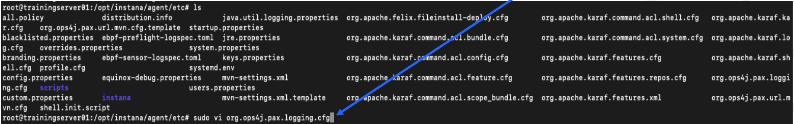
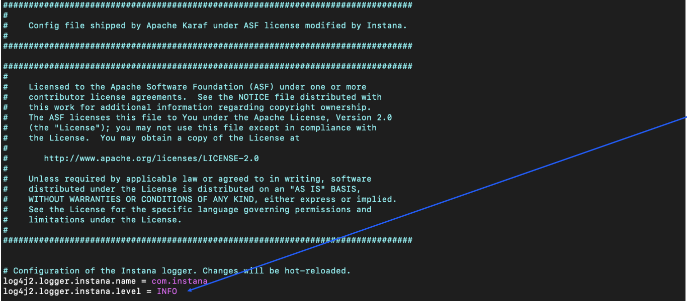

For this lab we will focus on Linux deployments of the Instana agent.

## Step 1:

We will SSH into the machine that was provided to us. Agent logs are located at:

```
/opt/instana/agent/data/log
```

In the event that there is an issue, this would be where we would pull our logfiles. 

This is an important area to have knowledge of, as support will ask for these logs during troubleshooting sessions. 

It is also possible to download the logs in the UI if you have access to the UI.

## Step 2: 

To start agent debug logging, you will need to stop the agent.

Enter the following in your terminal window:

```
sudo service instana-agent stop
```

We can then validate that the service has stopped by entering:

```
sudo service instana-agent status
```

Hint: type “q” to exit status command.



## Step 3:

Delete all of the files in /opt/instana/agent/data/logs

```
sudo rm *
```

Check to make sure files are deleted.

## Step 4:

To set the log level to debug, first browse to 

```
/opt/instana/agent/etc
```

We will be editing org.ops4j.pax.logging.cfg using the vi editor.

Note that a list of common vi commands are provided towards the end of this Lab Material. 

```
sudo vi org.ops4j.pax.logging.cfg
```



Now, change from INFO to DEBUG on the line seen below.
Check out vi commands if you are experiencing an issue.



Once you have modified with the proper value, save your work.

## Step 5:

Start the agent by entering the following line into the terminal window:

```
sudo service instana-agent start
```

Validate that the service has started by entering:

```
sudo service instana-agent status
```

## Step 6:

Verify logging is now at Debug by viewing the

```
/opt/instana/agent/data/log
```

Feel free to revert the log level to INFO if you'd like.


