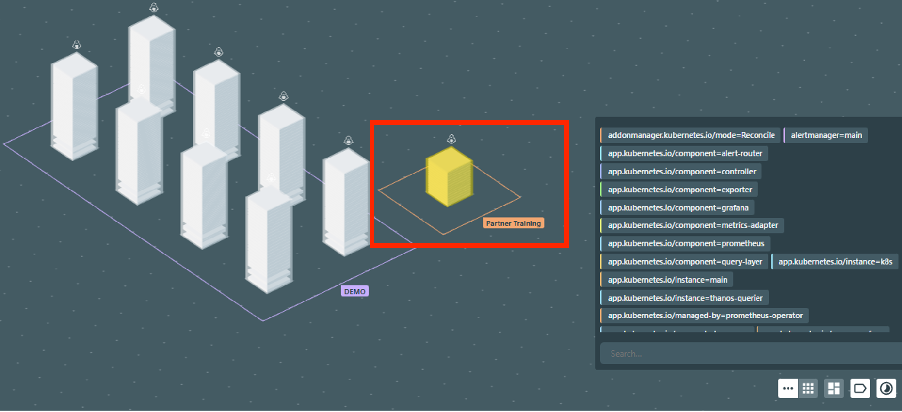
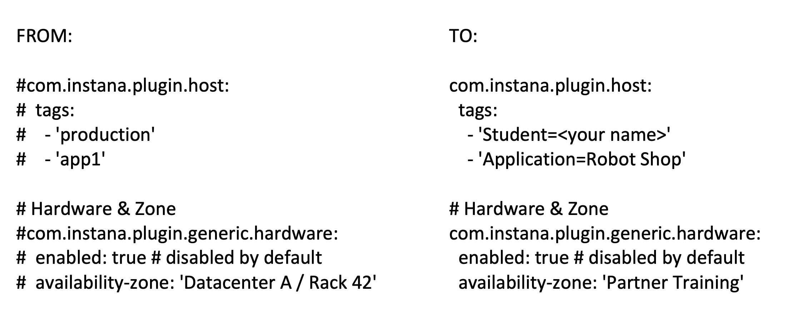
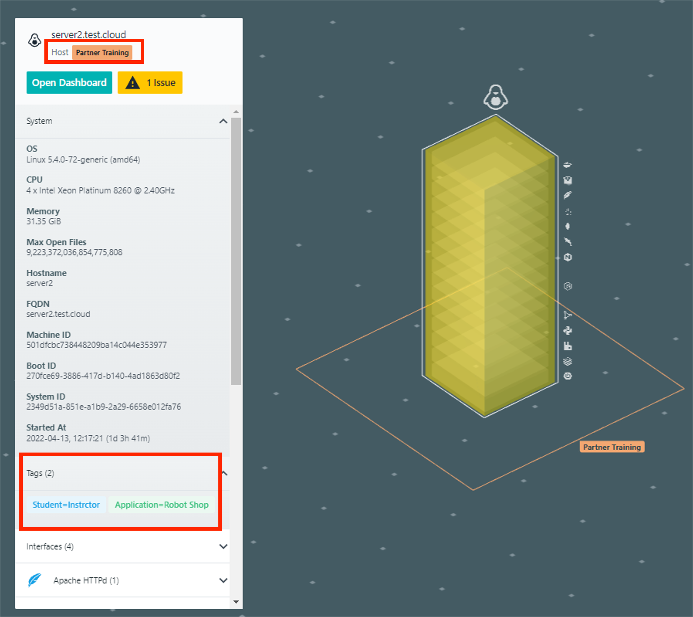

export const Title = () => (
  <span>
    Lab 3 - Agent Configuration <br />
  </span>
);
;

## Lab Overview

In this lab you will be configuring custom tabs and a custom zone. Custom tabs enable the searching and filtering of tags in the infrastructure map. Custom zones are where hosts are grouped into zones on the infrastructure map. You will learn how to set up custom tabs and custom zones by modifying your yaml file with vi commands. Custom tabs and zones also help with navigating the infrastructure map and organizing data by specific names or features. 




## Step 1:

SSH into your host and navigate to the directory:

```
cd /opt/instana/agent/etc/instana 
```

## Step 2:

Create a configuration-custom.yaml file. 

Copy the appropriate blocks from the configuration.yaml file to your new file.

```
sudo cp configuration.yaml configuration-custom.yaml 
```

## Step 3:
Using the sudo vi commands, look for the following sections within the configuration-custom.yaml file and make the following changes: 

```
sudo vi configuration-custom.yaml 
```



Note: 

Be wary of spacing. Yaml requires 2 space indentation. 

Also, check that the changes are uncommented in the yaml file.

Once these values have been modified, please save your work. 

## Step 4:

Validate that your work was successful by viewing your host in the Instana UI. 
Click on your host on the Infrastructure map and it will bring up details: 




