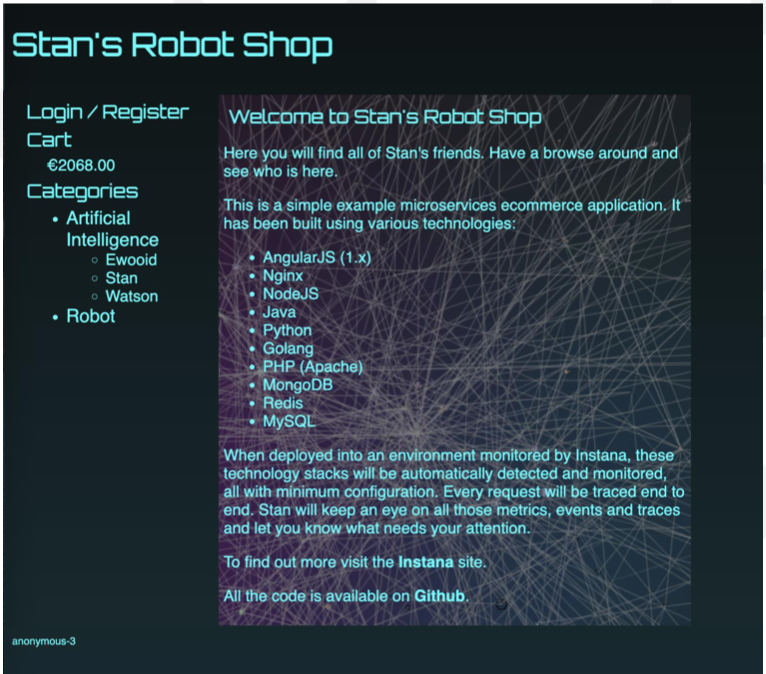
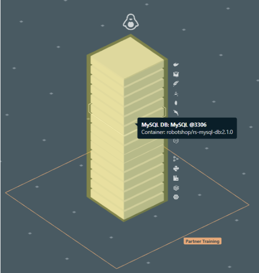
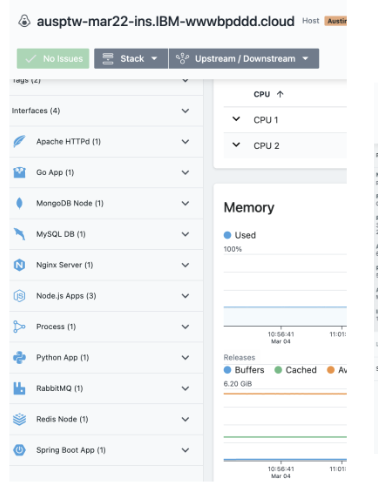
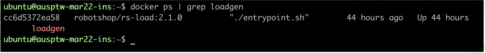

export const Title = () => (
  <span>
    Lab 4 - Robot Shop <br />
  </span>
);
;

## Lab Overview

In this lab you will be introduced to Robot Shop. Robot Shop is a sample microservice application that you can use as a sandbox to test and learn containerized application orchestration and monitoring techniques. We will be utilizing the Stan’s Robot Shop for all the labs following this. Note that Robot Shop has been pre-installed by your training team. Through this lab, you’ll run Robot Shop locally and use Instana to view key metrics about the application.

## Step 1:

SSH into thehost that was provided by your instructor, and browse to the installation directory for Robot Shop 

```
cd /home/ubuntu/robot-shop

```

## Step 2:

In your terminal window type 

```
docker-compose up -d
```

Note: -d runs it in the background

## Step 3:

Validate that Stan’s Robot Shop is up by going to:

http://(publicip):8080

If successful, you will see the following page:



Feel free to navigate around and buy some robots!

## Step 4:

Find your host in the Instana UI on the Infrastructure screen.

Hover your mouse over the host and notice all the entities being shown.



Open the host dashboard and see all of the components of Robot Shop visible.

Click on a few of them to open their respective dashboards and find the metrics streaming in automatically.




## Step 5:

Now we will generate the Robot Shop Load.

Browse to a directory within the robot-shop directory called “load-gen”

```
cd /home/ubuntu/robot-shop/load-gen
```

In your terminal window type: 

```
sudo ./load-gen.sh -d
```

Execute the following command to confirm that the loadgen container is running:

```
docker ps | grep loadgen
```



We will move on for now, but we will find the robot shop data in the Instana UI a little later in the training.