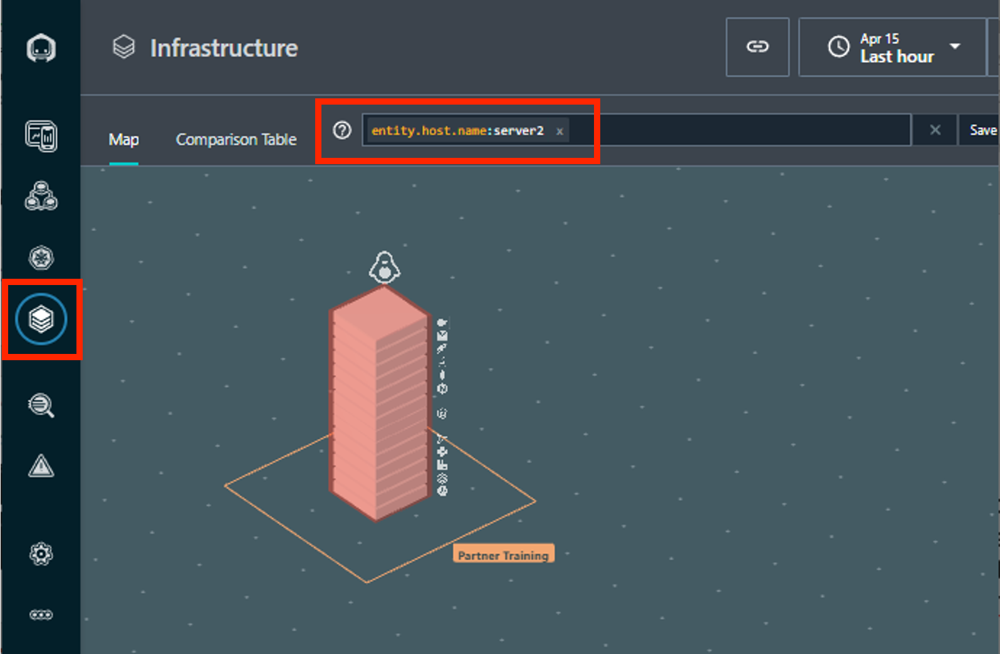

export const Title = () => (
  <span>
    Lab 5 - Dynamic Focus Query <br />
  </span>
);
;

## Lab Overview

In this lab you will be introduced to the Dynamic Focus search functionality. The Instana Dynamic Focus search functionality can be used to filter the 3D maps, comparison tables, and incident views. The search bar has extensive abilities to search using fuzzy and wildcard searches as well as boolean operators.

## Step 1:
Navigate to the Infrastructure screen in the UI.



## Step 2:

Use the following DFQs: 

```
entity.host.name:<your_host_name> 
```

```
entity.host.name:<your_host_name> entity.type:host 
```

```
entity.host.name:<your_host_name> entity.selfType:host 
```

```
entity.zone:”PartnerTraining” 
```

```
entity.tag:Student=<your_last_name> 
```

```
entity.tag:"Application=Robot Shop"
```

```
entity.tag:Student=<your_last_name> entity.type:jvm 
```
