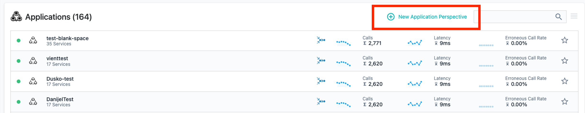
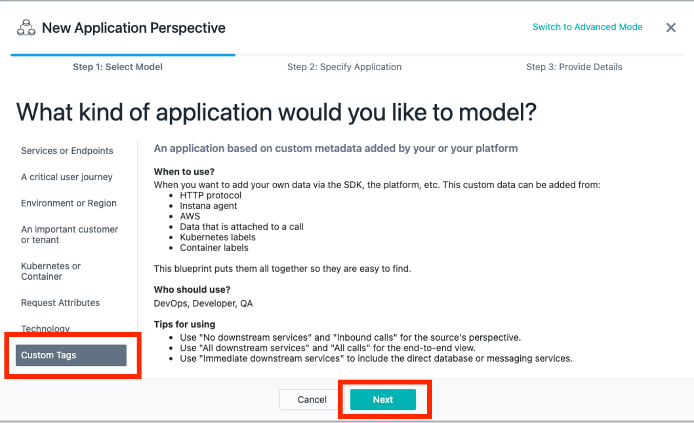
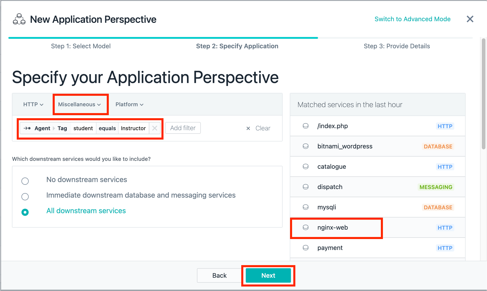
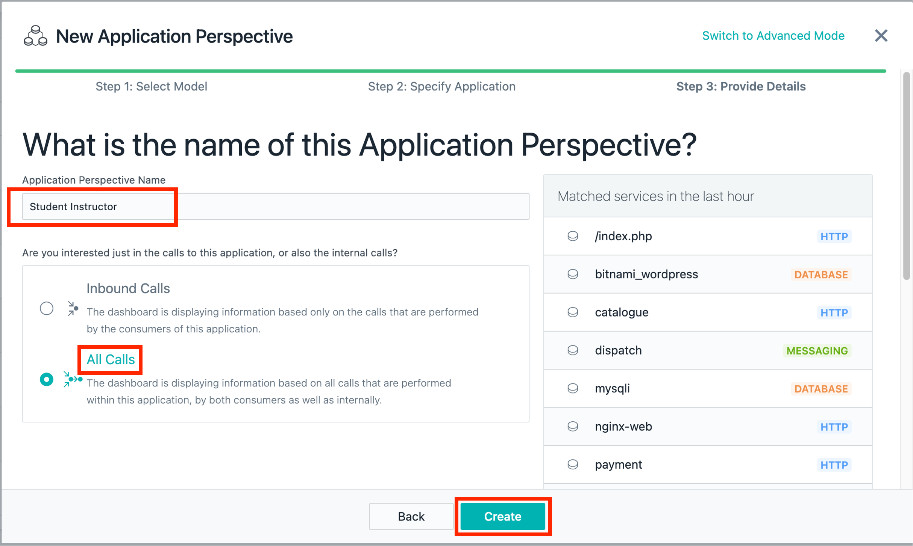
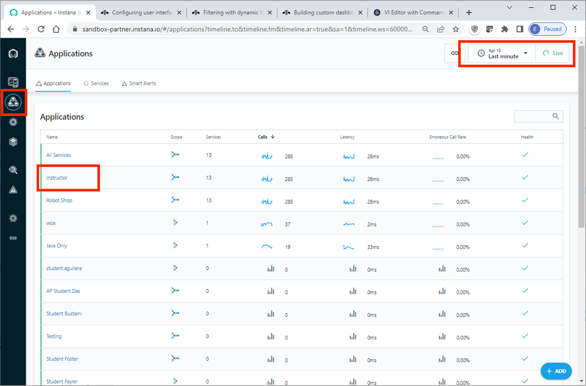

export const Title = () => (
  
    Lab 6 - Application Perspectives  
  
);
;

## Lab Overview

In this lab you will learn how to utilize Instana’s Application Perspective using your custom tags and zones. The Application Perspective (AP) auto-generates a feature rich monitoring dashboard where users can stay focused on the services they are interested in and not be distracted. AP’s can be customizable by technology, zone/cluster, version/release, and more. Alerts, errors, and logs are scoped to an AP to focus the troubleshooting.

## Step 1:

Click on the STAN icon

For the purposes of this lab, we will be utilizing the tags that we created in the previous labs. You will 
remember creating a tag called <Student=LAST NAME>. We will be utilizing this tag to create an Application Perspective.

## Step 2:

Click the New Application Perspective to create a new AP

## Step 3:

Select Custom Tags.

Then click Next.

## Step 4:

Select Miscellaneous from the drop down.

Select Agent Tag. Select Student from the list of Tags. Select "your last name" from the list of values.

Please notice the preview that is displayed. This will give us validation that our filter is properly formatted.

Click Next.

## Step 5:

Name your AP Student "your last name"

Select All Calls.

Click Create.

 

## Step 6:

Validate the new Application Perspective. It will take a minute or so before you see data populate the AP Dashboard.

To do this, start by clicking Application.

Make sure to turn on Live mode.

Verify that the new Application Perspective is listed.

