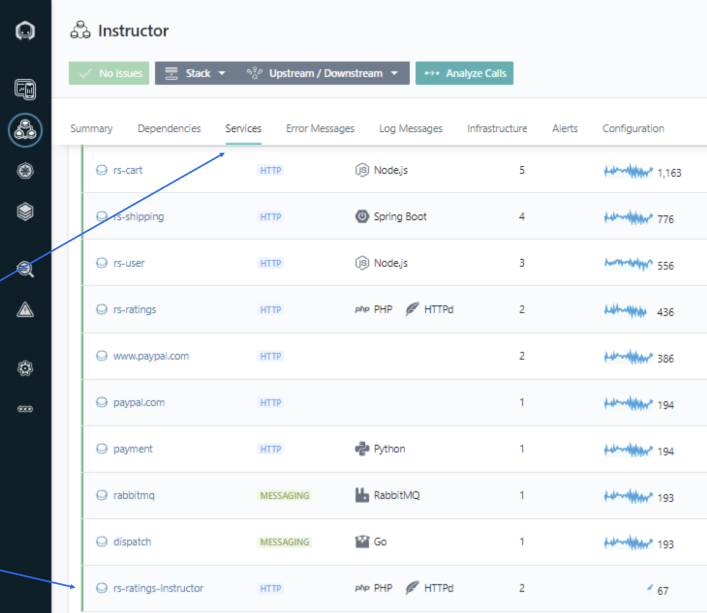

In this lab, we will change the name of the Ratings Service from rs-ratings to rs-ratings-your last name.

## Step 1: 

SSH into your host. 

```
sshubuntu@<IP address>
```

## Step 2: 
Navigate to the robot-shop/ratings directory 

```
cd /home/ubuntu/robot-shop/ratings 
```

## Step 3: 
Copy the file Docker file to Dockerfile.orig 

```
sudo cp Dockerfile Dockerfile.orig 
```

## Step 4: 
Edit the file Dockerfile 

```
sudo vi Dockerfile 
```

And add the following line: 

```
ENV INSTANA_SERVICE_NAME=rs-ratings-<your last name> 
```

## Step 5: 
Navigate back up to the robot-shop directory. 

```
cd /home/ubuntu/robot-shop/ 
```

## Step 6: 
Execute: docker-compose build ratings 

```
sudo docker-compose build ratings
```

## Step 7: 
Execute: docker-compose up -d ratings 

```
sudo docker-compose up -d ratings 
```

## Step 8: 
In the UI, find your service in your Application Perspective and verify the new name. 

Click Application, then Services, and lastly verify the name. 

