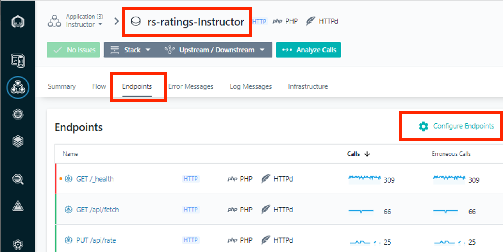
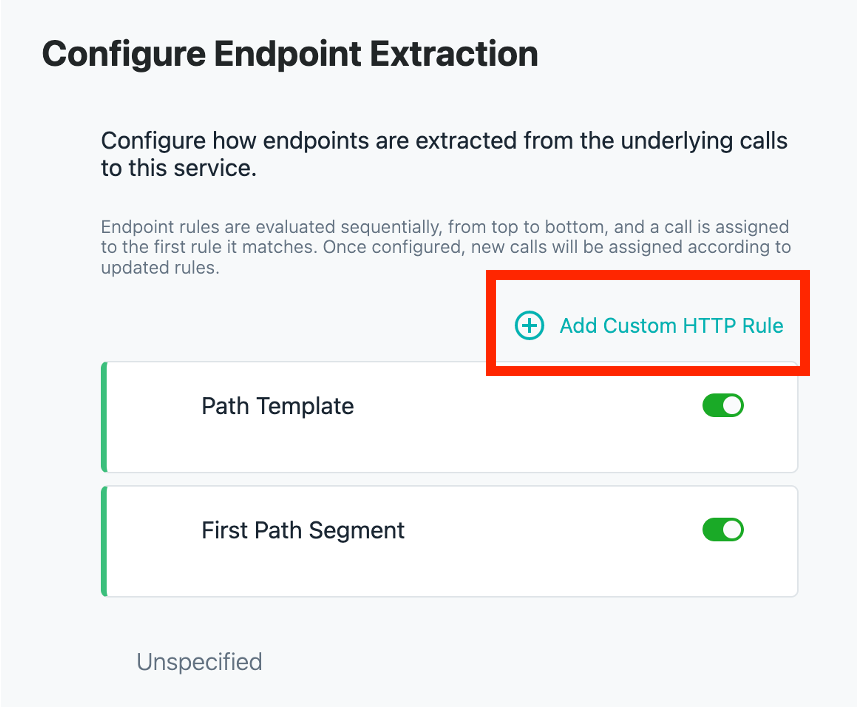
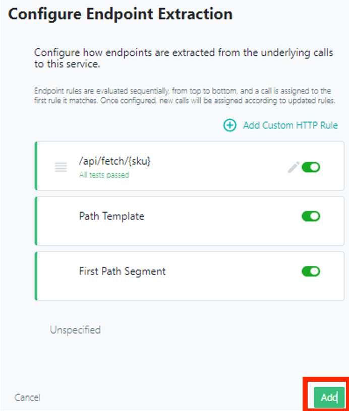

export const Title = () => (
  <span>
    Lab 8 - Endpoint Mapping <br />
  </span>
);
;

## Lab Overview

Endpoints define the API of a service and provide a fine-grained view into what operations are exposed by the services. Every call to a service happens on a single endpoint. In this lab you will configure a new endpoint extraction using an HTTP GET request. HTTP is just one type of endpoint. At the end of this lab, you will be able to see the new endpoint name you have created on the dashboard.

## Step 1:

Using the Instana UI, bring up the dashboard for your new rs-ratings-(your last name)service.

Then, Navigate to the Endpoints tab.

Click on the Configure Endpoints link.



## Step 2:

Click on the Add Custom HTTP Rule link.



## Step 3:

Enter the following in the Custom HTTP Rule field:

```
/api/fetch/{sku}
```

Feel free to use the Rule tester (copy an actual call from the data to the tester to verify the rule is working correctly).

Then, select save.


## Step 4:

Select Add.



And then verify that you see the new endpoint on the dashboard.
