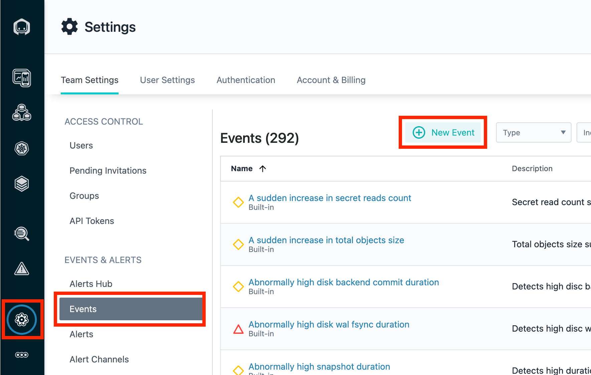
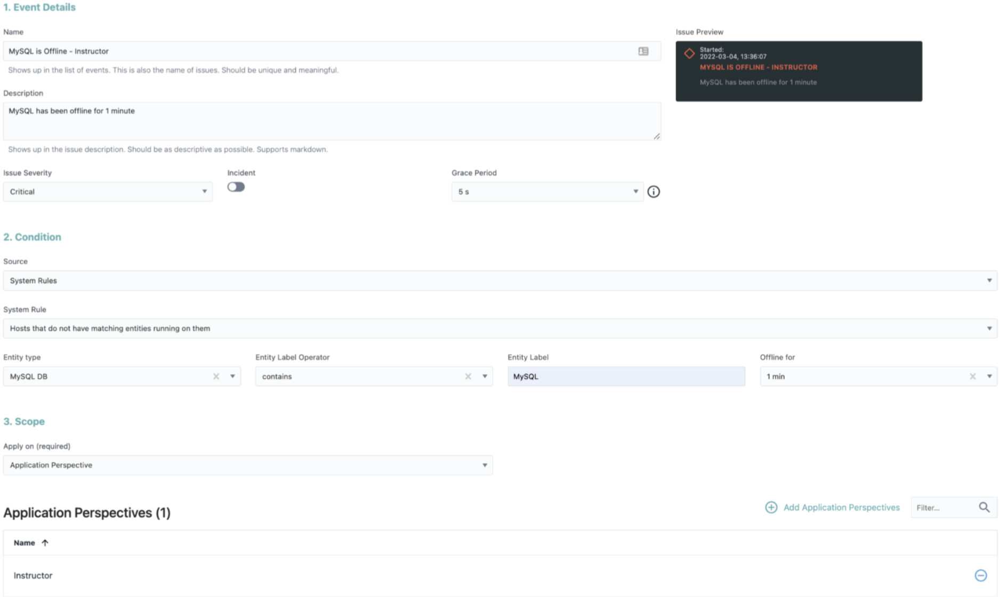
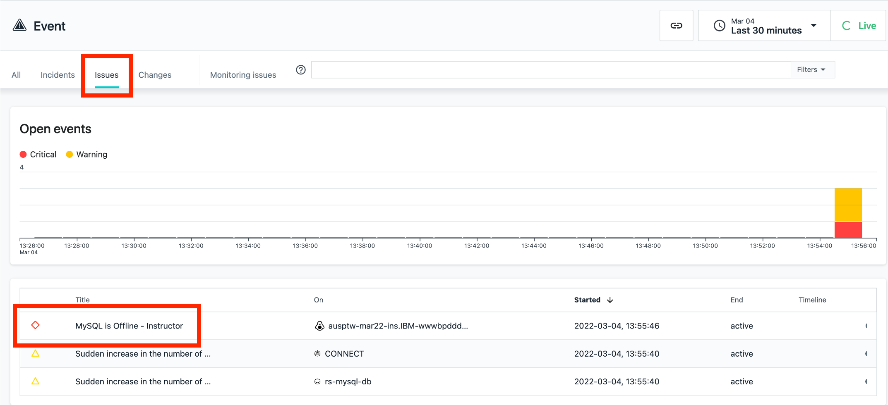

export const Title = () => (
  <span>
    Lab 9 - Custom Events <br />
  </span>
);
;

## Lab Overview

In this lab you will create a custom event. We will be creating an issue type event, which triggers when something out of the ordinary occurs. In this case, it triggers when a component of our application is offline. At the end of this lab, you will be able to verify that your event has triggered and review the event.

## Step 1: 

Click Settings. 

Then click Events. 

Lastly, click New Events. 



## Step 2:

Configure your Event with the following name: 

```
MySQL is Offline -<your last name> 
```

Enter Description of the Event to:  

```
MySQL has been offline for 1 minute  
```

## Step 3: 
Configure the settings the following way: 

Set the Issue Severity to Critical. 

Set the Grace Period to 5s. 

Set Condition Source to System Rules. 

For System Rules, select: Hosts that do not have matching entities on them. 

For Entity Type drop down, select MySQL DB. 

Change the Entity Label Operator to Contains. 

Enter MySQL in the Entity Label field. 

Select 1 min in the Offline for drop down. 

Select your Application Perspective for the Scope. 



Step 4: 

Stop the MySQL Container on your host. 

SSH into your host. 

Execute the following command: 

```
sudo docker stop robot-shop_mysql_1 
```

## Step 5: 

Verify that your Event has triggered. 

Select Issues. 

Review Event. 



