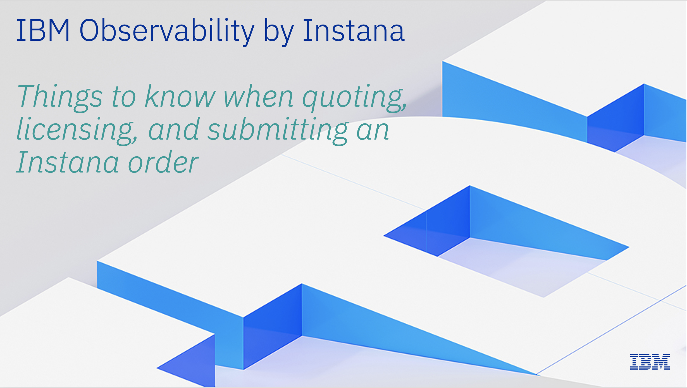

export const Title = () => (
  
    Instana Workshop Presentations  
  
);
;

<Row>
<Column colMd={4} colLg={4} noGutterMdLeft>
<ArticleCard
  title="Instana Overview, Pricing, and Packaging"
  href="https://ibm.box.com/s/qlnidbjf0j03holxsap105f858ce0r27"
  actionIcon="arrowRight"
>

</ArticleCard>
</Column>

<Column colMd={4} colLg={4} noGutterMdLeft>
<ArticleCard
  title="Instana Partner Workshop"
  href="https://ibm.box.com/s/rl70gohk2jxu2g77q9cl3gxemqhuq4av"
  actionIcon="arrowRight"
>

</ArticleCard>
</Column>

</Row>