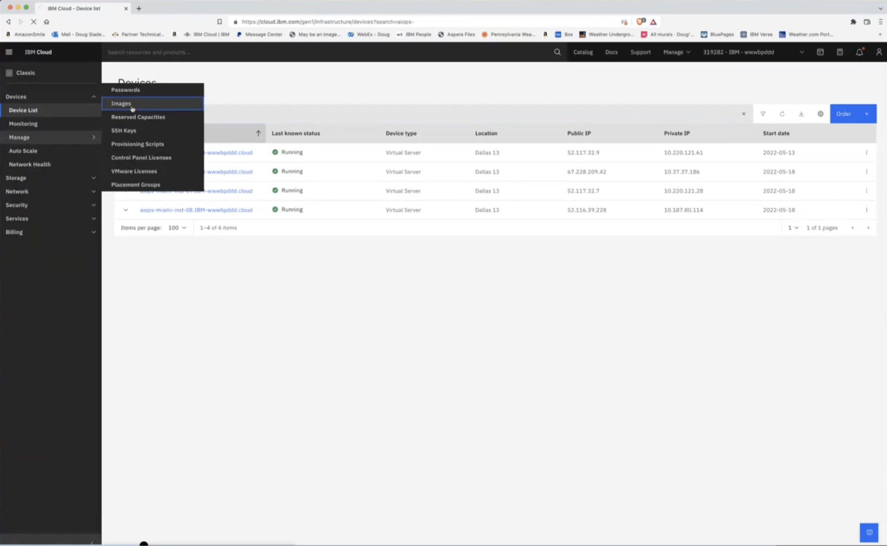
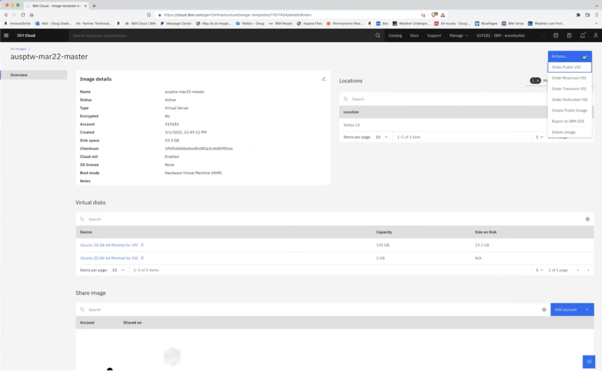
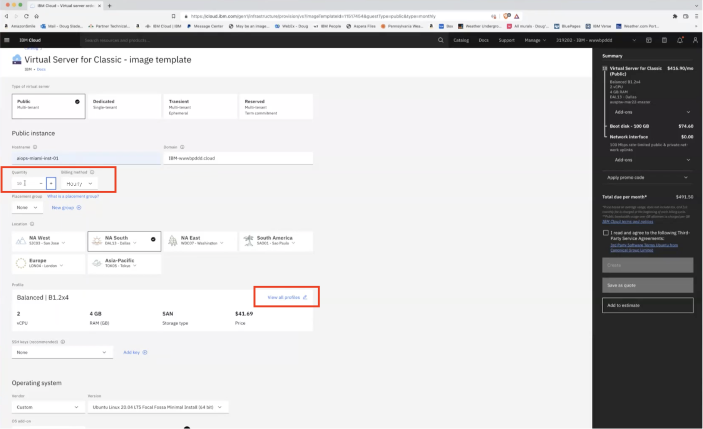
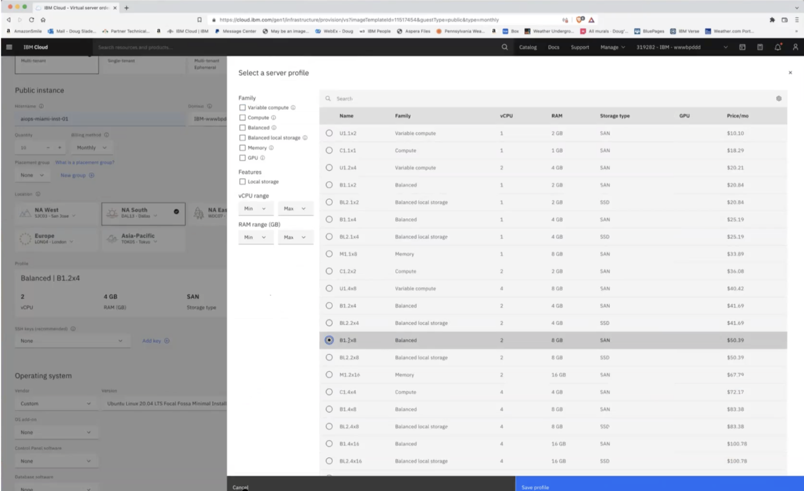
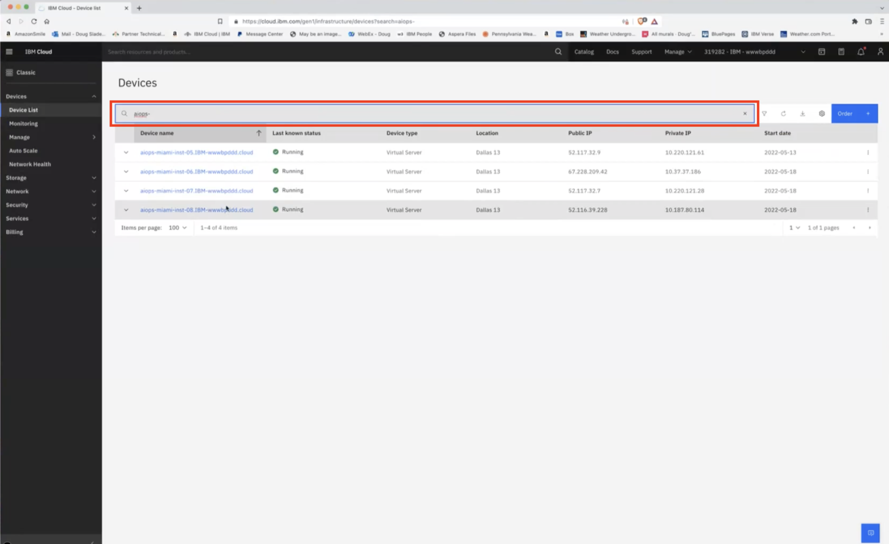
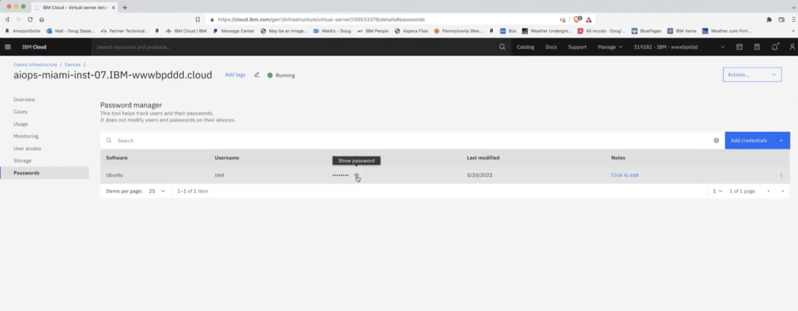

export const Title = () => (
  
    Instructor Setup Instructions  
  
);
;

# Creating Virtual Machines for class

Email Doug Slade (dugslade@us.ibm.com) with any questions or for access.

## Step 1: 

Navigate and login to IBM Cloud.

## Step 2:

Go to sidebar then Classic > Devices > Manage > Images 

## Step 3: 

Click on InstanaPOTStudentVMImages (old-> ausptw-mar22-master) which is the master image 

## Step 4:

Go to top right corner and click Actions > Order Public VSI

## Step 5:

Create a host name that is appropriate to the location of the class 

## Step 6:

Choose quantity (20 Max).

Change billing rate to Hourly.

Change profile to B1 2x8.

## Step 7:

Click the Create button in the right-hand sidebar 

# Once Virtual Machines are Created

## Step 1:

Search devices for “aiops-”

## Step 2:

Click on VM Image and go to Password tab

## Step 3:

SSH into each machine using the given password and change it to something more secure.
- ssh root@(machine-ip)
- passwd ubuntu
- (enter new ubuntu password [Do not use common password like "ubuntu"])

You can exit and SSH into machine again and verify ubuntu password works.

- ssh ubuntu@(machine ip)

