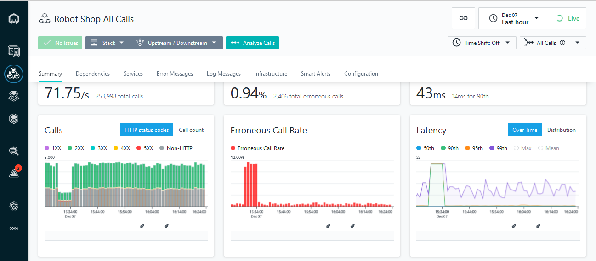

import HomepageTemplate from '../components/Homepage.js';
export default HomepageTemplate;

## What is Instana?

<PageDescription>

Instana is a fully automated Application and Performance Monitoring (APM) 
solution for cloud-native, multi-cloud, hybrid cloud, on premises, IBM Z® and 
more. With a single agent, Instana automatically discovers application building 
blocks, traces every request and creates a dynamic graph of all dependencies. See more at IBM's [Instana Website](https://www.ibm.com/cloud/instana?utm_content=SRCWW&p1=Search&p4=43700064490746231&p5=p&gclid=EAIaIQobChMI5vXN1su8-AIV1ODICh2eUA2SEAAYASAAEgLBLvD_BwE&gclsrc=aw.ds).

</PageDescription>

<FeatureCard
    color="dark"
    href="/SalesEnablement/sales"
    title="What is Instana"
    actionIcon="arrowRight"
    className="homepage-feature"
    >

<ArtDirection>

</ArtDirection>

</FeatureCard>
